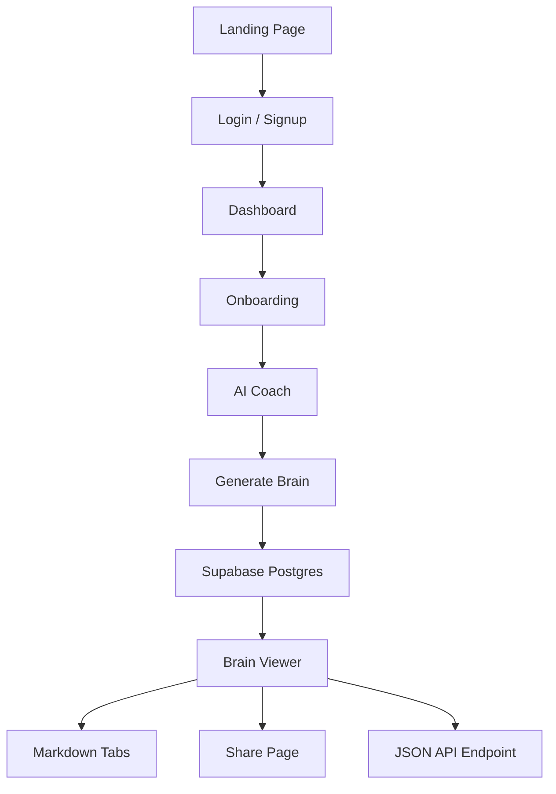

# OPT Coach

AI-guided Company Brain builder for service businesses. Turn founder knowledge, approval rules, workflows, pricing context, and hidden team judgment into structured markdown files, a shareable page, and a live JSON endpoint.

Built for the OpenAI x Outskill Hackathon.

`Next.js` `TypeScript` `Supabase` `AIML API` `Vercel Analytics` `Tailwind CSS`

[Live Demo](https://opt-coach.vercel.app) · [Company Brain Flow](#core-flow) · [Architecture](#architecture) · [Database](#database-setup) · [Roadmap](#roadmap)

## Overview

OPT Coach helps small teams document what usually lives only in the founder's head.

Most service businesses do not lack knowledge. They lack a clean operating brain that AI tools, teammates, and new hires can use. OPT Coach solves that with a short coaching flow: the user logs in, enters business details, answers focused operational questions, and receives a structured Company Brain.

The generated output includes:

- `KNOWLEDGE.md` for business model, clients, pricing, team structure, and metrics.
- `PROCESSES.md` for workflows, owners, triggers, steps, and decision points.
- `JUDGMENT.md` for quality criteria, approval rules, scoring logic, and escalation rules.
- A read-only share page for teammates.
- A raw JSON API endpoint for agent workflows.
- A private dashboard for previous chats and generated brains.

## Team

| Member | Role |
| --- | --- |
| Shivam Soni | Project creator. Product idea, MVP direction, frontend iteration, testing, hackathon submission, and product positioning. |
| Codex | AI pair-programming support for implementation, debugging, documentation, and production polish. |

## Why OPT Coach

| Problem | How OPT Coach solves it |
| --- | --- |
| Tribal knowledge is scattered | The coach asks structured questions and converts answers into reusable files. |
| SOP writing is slow | The app generates process docs automatically from a conversation. |
| AI agents lack business context | Every brain includes a machine-readable JSON endpoint. |
| Team judgment is hard to document | The flow captures approval rules, quality criteria, and decision logic. |
| Founders repeat explanations | Share pages and dashboards make knowledge reusable across the team. |

## Features

| Feature | Description |
| --- | --- |
| Guided Coaching Flow | A 5-question AI coach captures operating model, workflows, approvals, and hidden judgment. |
| Auth + Dashboard | Users can create an account, log in, view previous chats, and open generated brains. |
| Company Brain Generation | Converts a completed coaching session into `KNOWLEDGE.md`, `PROCESSES.md`, and `JUDGMENT.md`. |
| Downloadable Files | Users can download each generated markdown file and the raw API payload. |
| Share Page | Read-only public view for teammates, clients, or judges. |
| API Endpoint | Each brain exposes JSON at `/brain/[id]/api` for AI agent workflows. |
| Supabase Storage | Sessions and generated brains are stored in Supabase Postgres. |
| Vercel Analytics | Production page views are tracked through Vercel Analytics. |
| Responsive UI | Landing, login, dashboard, coach, brain view, and share pages are mobile-friendly. |

## Core Flow

1. User opens the landing page.
2. User logs in or creates an account.
3. User opens the dashboard and starts a new Company Brain.
4. User enters business name and selects a business type.
5. OPT Coach starts the AI coaching session.
6. User answers focused questions about operations, workflows, quality, and approvals.
7. The app generates the Company Brain.
8. User can view files, download files, share the page, or open the API endpoint.

## Architecture



## Key Technical Highlights

### 1. Structured Knowledge Extraction

The coach prompt is designed to capture the operating model, client profile, pricing, team roles, process steps, approval rules, and quality criteria. The goal is not just to chat, but to extract reusable business memory.

### 2. AI-Ready Output Format

The generated Company Brain is stored as both human-readable markdown and structured JSON. This makes it useful for teammates and for future AI agents that need business context.

### 3. Supabase-Backed Session Storage

The app stores active coaching sessions and generated brains in Supabase. A lightweight `kv` adapter keeps the application code simple while using Postgres as the primary database.

### 4. Authenticated Dashboard

Users can sign up, log in, and view saved brain files and previous chat sessions. The dashboard is designed as the user's private workspace.

### 5. Shareable Knowledge Artifact

Every generated brain has a clean read-only share page, so the result can be shown to teammates, judges, collaborators, or clients without exposing the full coaching session.

### 6. Download + API Access

Users can download `KNOWLEDGE.md`, `PROCESSES.md`, `JUDGMENT.md`, and the JSON API payload. This keeps the product useful even outside the web app.

## Tech Stack

| Layer | Technology |
| --- | --- |
| Frontend | Next.js 14 App Router, React 18, TypeScript |
| Styling | Tailwind CSS, custom pastel design system |
| AI | AIML API through an OpenAI-compatible client |
| Database | Supabase Postgres |
| Auth | Supabase Auth |
| Analytics | Vercel Analytics |
| IDs | Nano ID |
| Deployment | Vercel |

## Repository Layout

```txt
app/
├── api/
│   ├── chat/              # Streaming AI coach route
│   └── generate/          # Company Brain generation route
├── brain/[id]/            # Brain viewer, share page, and API endpoint
├── coach/                 # Guided coaching experience
├── dashboard/             # Logged-in workspace with saved brains and chats
├── login/                 # Login and signup page
├── onboard/               # Business setup flow
└── page.tsx               # Landing page

components/
├── analytics/             # Vercel Analytics client wrapper
├── auth/                  # Login form and navbar auth status
├── brain/                 # File tabs, code viewer, share panel
├── coach/                 # Chat UI, input, progress, brain preview
└── ui/                    # Shared shell and UI primitives

lib/
├── ai.ts                  # AIML/OpenAI-compatible client
├── auth.ts                # API auth verification helpers
├── brain-generator.ts     # Brain generation and JSON normalization
├── kv.ts                  # Supabase-backed storage adapter
├── prompts.ts             # Coach and brain-generation prompts
├── supabase.ts            # Server Supabase client
├── supabase-browser.ts    # Browser Supabase client
├── types.ts               # Shared TypeScript types
└── utils.ts               # Shared helper functions

supabase/
└── migrations/            # Database schema and dashboard auth migration
```

## Quick Start

### Prerequisites

- Node.js 20+
- Supabase project
- AIML API key
- Vercel account for deployment

### 1. Install Dependencies

```bash
npm install
```

### 2. Configure Environment

```bash
cp .env.example .env.local
```

Set the required values:

```env
NEXT_PUBLIC_SUPABASE_URL=
NEXT_PUBLIC_SUPABASE_ANON_KEY=
SUPABASE_SERVICE_ROLE_KEY=

AIML_API_KEY=
AIML_API_BASE_URL=https://api.aimlapi.com/v1
AIML_MODEL=openai/gpt-4o-mini

NEXT_PUBLIC_APP_URL=http://localhost:3000
```

### 3. Run Locally

```bash
npm run dev
```

Open:

```txt
http://localhost:3000
```

## Database Setup

Apply the Supabase migrations in order:

```txt
supabase/migrations/001_initial_schema.sql
supabase/migrations/002_user_dashboard.sql
```

The schema creates:

| Table | Purpose |
| --- | --- |
| `sessions` | Stores active and completed coaching sessions. |
| `brains` | Stores generated Company Brain records and markdown outputs. |

Verify recent sessions:

```sql
SELECT id, business_name, status, questions_answered
FROM sessions
ORDER BY created_at DESC
LIMIT 5;
```

Verify generated brains:

```sql
SELECT id, business_name, business_type, session_duration
FROM brains
ORDER BY generated_at DESC
LIMIT 5;
```

## Test Checklist

- Landing page loads and CTAs work.
- Login and signup work.
- Dashboard shows user name and saved items.
- Onboarding requires a business name.
- Coach starts automatically after onboarding.
- AI responses stream correctly.
- Brain generation completes after the coaching flow.
- Generated files are populated.
- Download buttons work for markdown files and API payload.
- Share page opens at `/brain/[id]/share`.
- API endpoint returns JSON at `/brain/[id]/api`.
- Mobile layout works on landing, onboarding, coach, dashboard, and brain pages.

## Roadmap

| Phase | Focus |
| --- | --- |
| Phase 1 | Stabilize MVP, polish dashboard, complete Supabase user-scoped history. |
| Phase 2 | Add editable brain files and regenerated sections. |
| Phase 3 | Add team workspaces and collaborator access. |
| Phase 4 | Add integrations for Notion, Google Docs, Slack, and agent tools. |
| Phase 5 | Add templates for agencies, freelancers, consultants, and startups. |

## Useful Links

- [OpenAI Platform](https://platform.openai.com/)
- [AIML API](https://aimlapi.com/)
- [Supabase Docs](https://supabase.com/docs)
- [Next.js Docs](https://nextjs.org/docs)
- [Vercel Analytics](https://vercel.com/docs/analytics)
- [Tailwind CSS](https://tailwindcss.com/)

## License & Credits

Built for the OpenAI x Outskill Hackathon as an MVP.

Created by Shivam Soni.

OPT Coach turns scattered business knowledge into an AI-ready operating brain.
